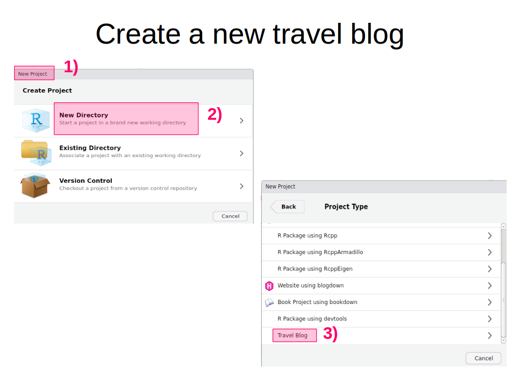
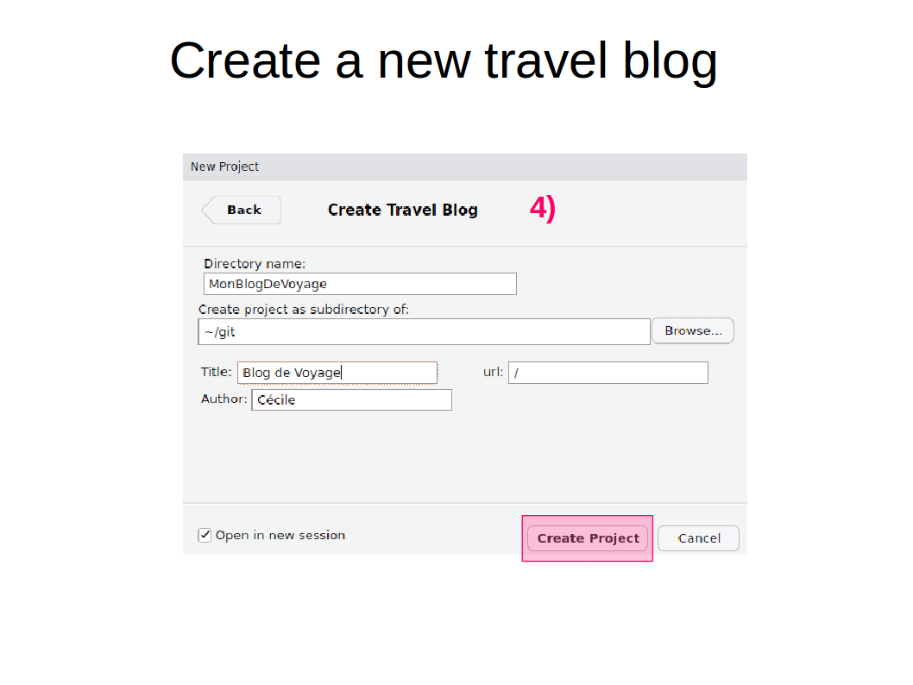
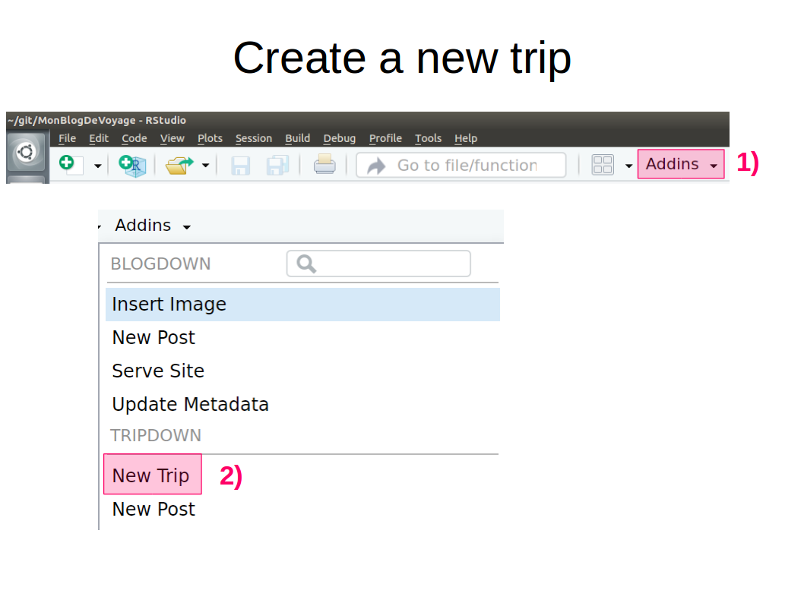
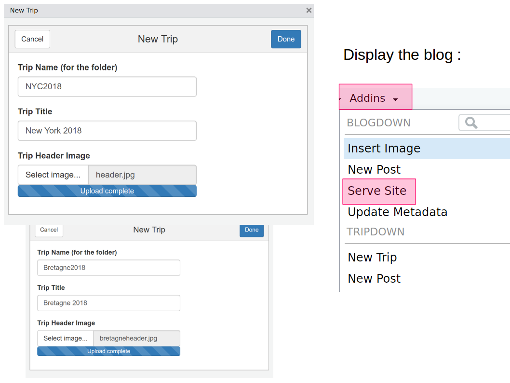
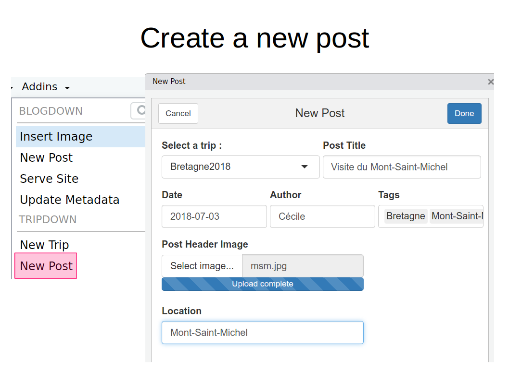

# tripdown
A R package to generate a travel blog based on [blogdown](https://github.com/rstudio/blogdown) and [well-traveled theme](https://github.com/mpaluchowski/hugo-well-traveled) 


## Installation

You can install it via GitHub with : 

```r
devtools::install_github('cecilesauder/tripdown')

library(tripdown)
```












